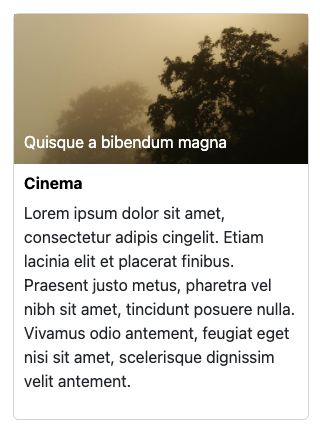
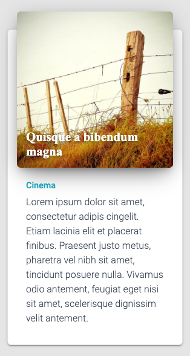

# Bienvenido al repositorio introductorio al ambiente de desarrollo!

Este proyecto/repo es destinado a medir diversas destrezas relacionadas a desarrollo de páginas en ambiente de ReactJS.

## Install

### Git clone

```shell
> git clone
```

### Install dependencies

```shell
> npm install
```

or

```shell
> yarn install
```

### Build Project

```shell
> npm run build
```

or

```shell
> yarn build
```

### Run project

```shell
> npm start
```

or

```
> yarn start
```

---

## Ejercicios

---

### Requisitos iniciales

> - Debes hacer clone del repositorio al momento de otorgar el acceso.
> - Crear branch nuevo según se le indique.
> - Ejecutar el proyecto y subirlo en modo de desarrollo (modo por defecto)
> - Hacer commit, push y crear Pull Request con el detalle de los cambios que deben evaluarse en los componentes. Es permitido subir imagenes de referencia de antes y después en el PR.

### Nivel: Básico

> En la página de ejemplo que se muestra al ejecutar el proyecto hay 3 fichas que no tienen estilos definidos. Para esta tarea debes proveer los estilos en formato css o scss para presentar un `Teaser` como se ve en la siguiente imagen.

| Basic Styling                                   | Pro Styling                                   |
| ----------------------------------------------- | --------------------------------------------- |
|  |  |
|                                                 |                                               |

#### Anotación

```txt
No es permitido hacer cambios en el componente. Solo se hará los ajustes en los estilos por medio del archivo de sass. 'src/styles/_modules/teaser.scss'
```

---

### Nivel: Intermedio

> Para esta tarea es requerido crear componentes en React tipo funcional (Functional Component) y tipo Clase (Class Component).
> La estructura de directorios del proyecto es la siguiente

```shell
.
+-- components
|   +-- features
|   |   +-- features-component-name
|   |   |   +-- default.jsx
|   |   |   +-- default.test.js
|   +-- layouts
|   |   |   +-- basic-frame.jsx
|   |   |   +-- basic-frame.test.js
|   |   |   +-- frame-name.jsx
|   |   |   +-- frame-name.test.js
+-- content
|   +-- data
|   |   +-- data-source.json
|   +-- models
|   |   +-- class-model.jsx
|   |   +-- class-model.test.js
|   +-- source
|   |   +-- content-source-name.jsx
|   |   +-- content-source-name.test.js
+-- public
|   +-- assets
|   |   +-- css
|   |   +-- fonts
|   |   +-- images
|   |   +-- js
|   +-- index.html
+-- src
|   +-- styles
|   |   +-- _modules
|   |   |   +-- module.scss
|   |   +-- index.scss  <-- Fuente principal de estilos
|   |   +-- index.js  <-- React import para los estilos
|   +-- index.js  <-- Página inicial
```

> La tarea en este ejercicio es romper en distintos componente el archivo de `basic-frame.jsx`
> Al hacer la separación este archivo debe contener solo el retorno de un `frame` de html incluyendo los children que se pasarán como props.
> Los componentes deben estár creados en la estructura de directorios provistos para ellos `components/features/`

#### Consideraciones

- Debes producir componentes funcionales para Header, PageHead, Footer y Teasers
- Debes producir componentes de clases para Section
  - Debe aceptar un prop que indique la categoría/sección que debe pintar.
  - Se incluirá multiples veces en el layout para desplegar distintos componentes simulando distintas fuentes de contenido.
- Solo debes hacer render del HTML.
- Rendimiento es un factor importante para nosotros. ¿Consideras que esta la mejor implementación? Si no, cuál es la mejor forma. Codifica la mejor solución.

#### Datos importantes a tomar en cuenta

- Consistencia en el código
- Nombramiento de variables y componentes
- Coverage en los Tests

---

### Nivel: Avanzado

> Luego de haber completado el nivel intermedio puedes proceder con esta tarea.
> Utilizando los archivos de las fuentes de datos (`content/data/`) haz los cambios en el componente de clase Section. Utilizando el prop de `section` para determinar la fuente de dato a devolver.

#### Detalle

- Crea los siguientes archivos
  - Una o dos clase para modelo de datos (`content-model`). Artículo y Arreglo de artículos.
    - Incluye una función en la clase para extraer los datos de la fuente de datos y devolver el modelo creado en la clase.
  - Fuente de contenido (`content-source`). Este archivo debe tomar el archivo json (simulando repuesta del API) y crear un objecto (`content-model`) del modelo de datos previamente creado. Construir una respuesta con los datos devueltos por la clase donde tengas un arreglo de artículos y metadata.

#### Resumen

> El componente de Section debe tomar el prop de section y pedir al `content-source` pasando el section. El content-source debe subir la fuente de datos correspondiente y crear una respuesta utilizando el modelo de datos provisto por la clase. Finalmente devolver la respuesta al Componente de clase para hacer render de los Teasers utilizando los datos que el `content-source` devolvió.

- Basic-Frame -> Section(entretenimiento) -> content-source -> data.json -> content-model -> OBJ
- Basic-Frame -> Section(deportes) -> content-source -> data.json -> content-model -> OBJ

#### Consideraciones

- Rendimiento es un factor importante para nosotros. ¿Consideras que esta la mejor implementación? Si no, cuál es la mejor forma. Codifica la mejor solución.

### Nivel: Experto (Dockerinzing app)

> Presentar un plan según su consideración en un artículo de markdown o texto como parte del branch.

### Nivel: I'm a Full Stack Developer (CICD pseudo code + HTTPS)

> Presentar un plan según su consideración en un artículo de markdown o texto como parte del branch.

---
